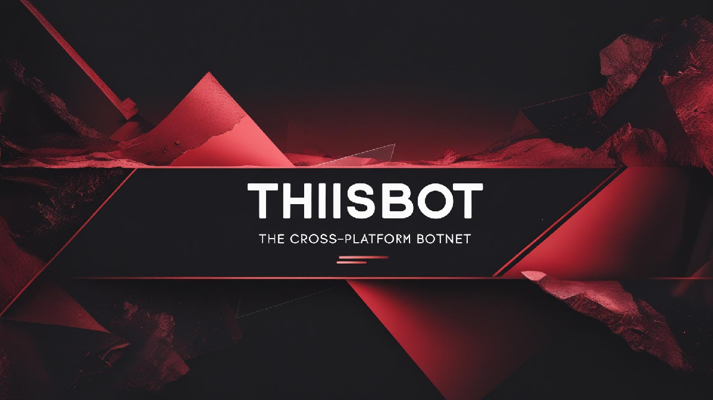

<h1 align="center">☢️ThisBot Project☢️</h1>
<p align="center">
    
</p>

A lightweight Go-based HTTP botnet framework built for <b>educational purposes</b> , <b>Go language learning</b> , and <b>security research</b> .<br/>
<p align="left">
  
  
  
  
  
</p>

# 📌 Features
1. Remote Download Execute: It could execute a local executable or download from remote host and execute
2. Evasion: anti-vm, anti-sandbox and anti-debugger features
3. Operation logs: It could record all opeartions or export
4. Task logs: Check task status and manage it or export
5. Friendly builder
6. Install function
7. Auto-startup

# ⛏️ How to use it
- Install Mysql server [Mysql Community Version](https://dev.mysql.com/downloads/mysql/) and start. (currently, server only support working on windows)
- Execute sql file in Mysql client(Even in cmd is enough)
```
use Your_Database_Name;
source "X:/YouPath/thisbot.sql";
```
- Open cmd.exe, type following command to generate basic configure and configure yours
```bash
ThisBotC2.exe --init-config
```
- Run ThisBotC2.exe in cmd/powershell, then use "help" command first

# 🔭 How to compile it
- Install go environment(Best is Go 1.25.4)
- Run **build.ps1** which located in client and server folder.
```bash
# release or debug are all okay
build.ps1 [release/debug]
```

# ⚠️ Disclaimer / Terms of Use
This software is provided strictly for educational and legitimate security research purposes only.  
It must not be used for:
* Unauthorized access
* Intrusion, exploitation, or disruption of systems
* Any illegal or unethical activity
The user assumes full responsibility for compliance with all applicable laws.  
The author(s) are not liable for any misuse, damages, or legal consequences.
If you do not accept these terms, do not use this software.<br/>
⚠️ Legal Notice: This project is strictly for authorized testing, education, and research.  
Misuse of this software may violate laws. Read the disclaimer below before using.

# ⭐ Support
If you find this useful, feel free to star the repository once you publish it.

# 💬 Contact
For questions or contributions, feel free to open an Issue or Pull Request.
My Telegram: @Zymikek
